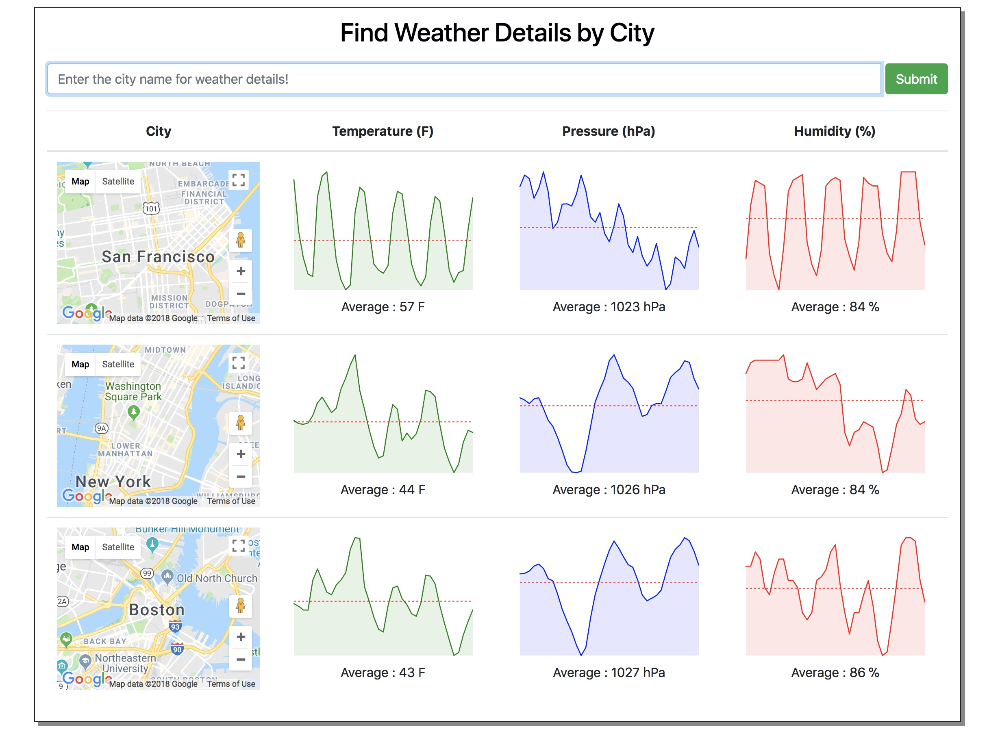
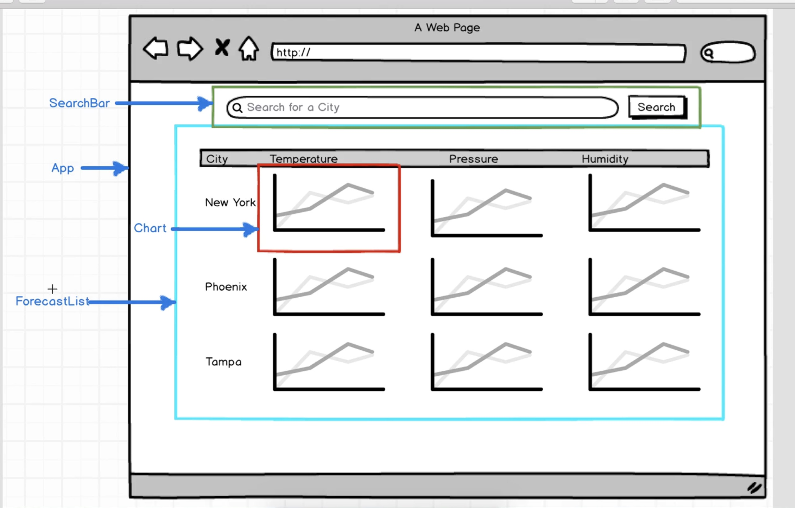

# Redux-ForeCaster:

App is desgined to display realtime wheather forecast for a given city in USA.

### [Click here to access the app](https://desolate-waters-75861.herokuapp.com/)

## Motivation :

To understand implementation of Redux.

## Technology,Frameworks & APIs Used:

React,Redux,React Sparklines,Lodash
OpenWeather API, Google Map API

### React Components Overview

